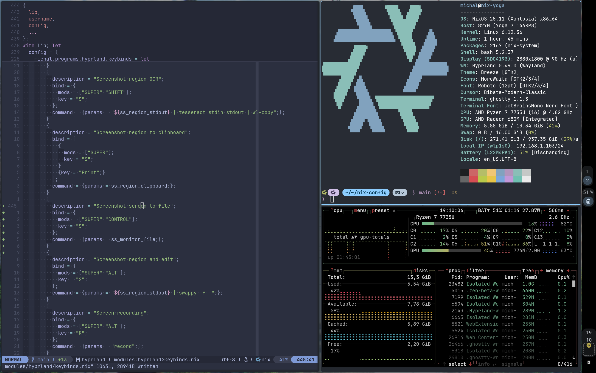

# Nix Config



Welcome. I hope you get inspired here.
It can be hard to put together a NixOS config, it certainly was for me. This is mainly because you can structure it however you want.

My config is based on [CirnOS](https://github.com/end-4/CirnOS) ([docs](https://end-4.github.io/dots-hyprland-wiki/en/i-i/02usage/)), [erictossell's flake](https://github.com/erictossell/nixflakes) and [konradmalik's dotfiles](https://github.com/konradmalik/dotfiles/tree/main), go and give them a star!

## Quick Links

- [Neovim config](modules/nvim/init.lua)
- [Hyprland config](modules/hyprland/)

## Structure Overview

The configuration starts with definition of hosts (computers) in [`hosts/default.nix`](hosts/default.nix).
Each `nixosSystem` defines arguments like `username` and `hostname`, which are available in all subsequent *modules*.
Each [NixOS module](https://nixos.wiki/wiki/NixOS_modules) defines some [configuration options](https://search.nixos.org/options), like [packages](https://search.nixos.org/packages) to install, services to run, or files to include.
My modules are mixed with home-manager, which I use to manage files in home.

I also define some *services*, which allow me to easily host them.

## Installation

The flake includes my hardware configuration, so you would need to create your host in `hosts/`.

```bash
git clone https://github.com/Sekky61/nix-config && cd nix-config
sudo nixos-rebuild switch --flake ".#hostname"
```
(substitute your `hostname`)

or use the prepared script:

```bash
./scripts/update [--hostname=<hostname>] [--remote] [--impure]
```

### Raspberry PI, ISO and Installers

Installing on a new machine requires generating `hardware-configuration.nix` and adding it to the flake. You need to get the machine running with Nix, generate the configuration, and then you can use [nixos-anywhere](https://github.com/nix-community/nixos-anywhere) or update via ssh.

**1. Get NixOS on the machine**

Build a minimal ISO (x86) or Raspberry Pi SD card image:
```bash
nix build .#minimal-iso
# or
nix build .#minimal-pi-sd-image
```

Flash it (you may need to unpack it first: `unzstd -d rpi.img.zst`):
```bash
sudo dd if=installer.iso of=/dev/sdX bs=4096 conv=fsync status=progress
```

Find the IP of the installed device:
```bash
sudo nmap -p 22 192.168.0.0/24
```

**2. Install**

Partition the drives as you wish, then generate the new `hardware-configuration.nix`. Finally, install the system:
```bash
sudo nixos-install --flake github:Sekky61/nix-config#nixpi --root /mnt --no-bootloader
```
The `--no-bootloader` flag is unverified.


### Deployments

Deployments with `deploy-rs` are possible with command such as

```bash
deploy .#nixpi --skip-checks
# or with impure due to all the checks of impure hosts
IMPURITY_PATH=$(pwd) sudo --preserve-env=IMPURITY_PATH deploy .#nixpi -- --impure
```

This command would copy to the target and confirm all went well.

## Impurity

Each host definition has its complement `$hostname-impure`.
Impurity means that certain files, like the Neovim config, get linked to this repository instead of the nix store. This is useful for fast iterations on configs.

To use it, run `./scripts/update --impure`.

## Key Features

### Greetd
Uses `tuigreet`, on login launches Hyprland.

### Hyprland
The window manager. See shortcuts with `Super+/`.
Launches Chrome on startup. Uses Ags/astal bar.

### Theme
The wallpaper is set in `hyprpaper.nix`.
Theme colors can be derived from the wallpaper, picked, or be based on a color.
See the `./scripts/theme` script. You must update the configuration for it to take effect.

### Neovim

Try my nvim. Just run `nix run github:Sekky61/nix-config#nvim`. Just note that it will install plugins to home.

The `nvim` config (located [here](modules/nvim/init.lua)) contains many useful plugins and keybinds with descriptions. The plugins get installed at launch, so this is not a pure Nix solution.

### Terminals
Multiple terminals are configured. Choose one of them to be the default one (works with keybinds).

### Backups
[Borg](https://borgbackup.readthedocs.io/en/stable/) ([module](modules/borg.nix)) is used with the cloud solution [BorgBase](https://www.borgbase.com/). There is a daily backup with some weekly and monthly retention.

If you find yourself on a new computer, or just want to restore, here are the steps:
```bash
./scripts/mount-backups
sudo -s
cd mount/<whatever>
cp <whatever> <destination>
```
You may need to change permissions on the destination: `sudo chown -R michal:users Documents`.
To unmount: `sudo borg umount ./mount`.

### Custom Options
The modules are gradually becoming configurable via the `michal` namespace. The other features are selectively imported by hosts as modules.

```nix
michal.programs # Programs that might be not desired everywhere
michal.services # Long running services like Home assistant
michal.graphical # Enable GUI-based apps
```

See `./scripts/list-custom-options` for more.

## Secrets Management

Secrets are managed using [sops-nix](https://github.com/Mic92/sops-nix). There is one universal age key for development which is backed up in a password manager.

**Adding a host without importing keys:**
1. The first run of `nixos-rebuild` should put ssh keys in `/etc/ssh/ssh_host_ed25519_key(.pub)`. These will be used for decrypting sops secrets.
2. The first run should fail (no keys yet).
3. After the fail, derive a new age pubkey with `scripts/age-pubkey`.
4. Add this pubkey to `.sops.yaml`.
5. Run `sops updatekeys modules/sops/secrets.yaml`. This may require an existing key to be present (like a dev key).

**Adding a host with imported keys:**
- Before running `nixos-rebuild`, put the keys in `/etc/ssh/ssh_host_ed25519_key(.pub)`.
- You can verify that the pubkey is already in `.sops.yaml` by comparing the output of `scripts/age-pubkey`.

**Rotating a key:**
```bash
sops rotate --in-place --add-age age1xxxxxxx modules/sops/secrets.yaml
```

**First install notes:**
I used to have passwords set up with sops, but it was difficult to recover from mistakes. Now passwords are not declarative; just set them once. You may need to put a private age key in `~/.config/sops/age/keys.txt` to work with sops.

## Development

### Adding new host (computer)

1. Create (copy) entry in `hosts` directory. Pick a name for the host.
2. Use the `hardware-configuration.nix` from the new host
3. Configure `michal` options as you wish, apply configuration for hardware quirks
4. For secrets, see the SOPS section
5. Run `hyprctl monitors` and write down the info
6. You may need to apply theme (dark mode) manually. See the theme script.
7. Add ssh key identity (ssh-add command)
8. Create sops private key and add it to the right place: `sudo ssh-to-age -private-key -i /etc/ssh/ssh_host_ed25519_key > ~/.config/sops/age/keys.txt`
9. `atuin login` and `atuin sync`. Find the key in sops.

### AGS Notes

To get TypeScript types:
```bash
cd modules/gui-packages/ags/config
npm i
```

- Press `Super + /` to open the list of keybindings.
- See the [AGS docs](https://aylur.github.io/ags/) and [GJS docs](https://gjs.guide/).
- The `corner-black` class makes a fake rounded screen.
- The `corner` class controls the rounding of the top bar.
- Media widget: left-click for detailed controls, middle-click to play/pause, right-click for the next track.
- To debug, kill ags with `ags quit` and then launch it in a shell: `ags` (or with a `--directory` flag).
- Look up icons with [icon-browser](https://github.com/Aylur/icon-browser/tree/main).
- Use `ags inspect` as an inspector.

### General Notes
- Rpi's service for wlan: `systemctl status wpa_supplicant-wlan0.service`
- Take a look at [https://github.com/NotAShelf/nyx/tree/main](https://github.com/NotAShelf/nyx/tree/main), a great inspiration.
